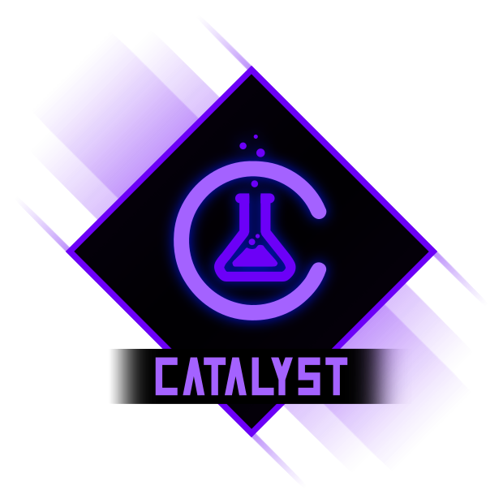

# Catalyst



*Make your stats work like magic*

Catalyst is a flexible statistics and modifier engine for GameMaker.

It sits between your base stats and all the gear, augments, buffs, auras, and debuffs in your game, and gives you a clean, predictable way to get the final value.

## Features at a glance

* Simple numeric stats via `CatalystStatistic`.
* Flat and multiplicative modifiers via `CatalystModifier`:

  * `ADD`, `MULTIPLY`, `FORCE_MIN`, `FORCE_MAX`.
* Ordered layers so different sources of power stack predictably:

  * `BASE_BONUS` (attributes, level scaling)
  * `EQUIPMENT` (weapons, armor)
  * `AUGMENTS` (runes, talents)
  * `TEMP` (short-lived buffs/debuffs)
  * `GLOBAL` (late-stage auras and global effects)
* Timed modifiers with durations:

  * A global `CatalystModifierTracker` handles countdown and expiry.
  * You drive it with `CatalystModCountdown()` once per tick (step/turn/second).
* Context-aware evaluation:

  * `GetValue(context)` can evaluate "right now, in this situation" without mutating the stat.
* Conditional modifiers:

  * "+50% damage only vs frozen targets", "bonus speed when HP < 25%", etc.
* Stacks (event-driven) and context-driven stacks (`stack_func`):

  * Perfect for "per burning enemy nearby" style effects.
* Modifier families and stacking rules:

  * "Only the strongest aura applies" via `HIGHEST` / `LOWEST`.
* Safe previews ("what if I equip this?"):

  * `PreviewChange` / `PreviewChanges` simulate changes without actually attaching modifiers.
* Tags and source tracking for cleanup and UI:

  * Remove by tag ("cleanse all debuffs") or by source label/id/meta.

## Quick start

Create stats, add modifiers, and query the final value.

```js
// obj_player Create event
stats = {
	damage : new CatalystStatistic(10).SetName("Damage"),
	speed  : new CatalystStatistic(4).SetName("Move Speed"),
};

// Weapon adds +3 damage as equipment
var _weapon_mod = new CatalystModifier(3, eCatMathOps.ADD)
	.SetLayer(eCatStatLayer.EQUIPMENT)
	.SetSourceLabel("Rusty Sword");

stats.damage.AddModifier(_weapon_mod);

// Temporary buff: +50% damage for 5 ticks
var _rage = new CatalystModifier(0.50, eCatMathOps.MULTIPLY, 5)
	.SetLayer(eCatStatLayer.TEMP)
	.SetSourceLabel("Rage Potion");

stats.damage.AddModifier(_rage);
```

Drive duration countdown from your game loop:

```js
// obj_game_controller Step event (or wherever your "tick" lives)
CatalystModCountdown();
```

Read the stat value anywhere:

```js
var _dmg = stats.damage.GetValue();
```

Preview changes without mutating anything (great for item hover / compare UI):

```js
var _current = stats.damage.GetValue();
var _preview = stats.damage.PreviewChange(0.15, eCatMathOps.MULTIPLY, eCatStatLayer.AUGMENTS);

// "Damage: 18 -> 21" style UI
draw_text(x, y, "Damage: " + string(_current) + " -> " + string(_preview));
```

## Includes Echo for free

Catalyst includes **Echo**, a debug logger and debug UI builder, entirely for free:

[Echo on itch.io](https://refreshertowel.itch.io/echo)

## Documentation

Full online docs for Catalyst are available here:

[Catalyst Documentation](https://refreshertowel.github.io/docs/catalyst/)

## Where to buy

Catalyst is available on itch.io:

[Catalyst on itch.io](https://refreshertowel.itch.io/catalyst)

## Bug reports and feature requests

The best place to report bugs or request features is the GitHub Issues page:

Issues:
[Catalyst GitHub Issues](https://github.com/RefresherTowel/Catalyst/issues)

If you are not comfortable using GitHub, you can also post in the RefresherTowel Games Discord and I can file an issue for you:

[RefresherTowel Games Discord](https://discord.gg/qx6GtfVWJR)

## License

Catalyst is a paid framework. The license terms for using it in your projects are in:

[LICENSE_Catalyst.txt](LICENSE_Catalyst.txt)

In short: it's licensed per developer seat, you can use it in unlimited games (free or commercial), but you cannot redistribute the framework source itself.
